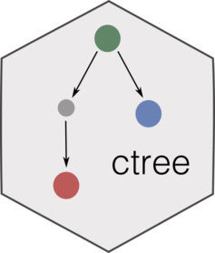

# mtree <a href='https://caravagn.github.io/mtree/'>  </a>

<!-- badges: start -->

[](https://travis-ci.org/caravagn/mtree)
[](https://www.tidyverse.org/lifecycle/#maturing)
[](https://caravagn.github.io/evoverse)
<!-- badges: end -->

Thee `mtree` package provides a simple implementation of *mutation
trees* in cancer.

Mutation trees can be built from binary data reporting the presence or
absence of specific mutations - or any other somatic covariates - across
a number of tumour regions. In this `mtree`, we integrate [Chow-Liu
trees](https://en.wikipedia.org/wiki/Chow%E2%80%93Liu_tree) with
[probabilistic
causation](https://plato.stanford.edu/entries/causation-probabilistic/).

This type of models can be used to study the evolutionary trajectories
of a tumour from bulk sequencing data, especially in setups where only
targeted sequencing panels are available and methods for subclonal
deconvolution cannot be used.

  - `mtree` provides an S3-based implementation of mutation trees, as
    well as a Monte Carlo sampler that has been discussed in [Caravagna
    et al;
    PMID: 30171232](https://www.ncbi.nlm.nih.gov/pubmed/30171232). The
    package provides also functions to plot and analyze the trees.

  - The sibling of a mutation tree is a *clone tree*, which is obtained
    from subclonal deconvolution of bulk samples when whole-genome/
    exome sequencing is available; clone trees are implemented in the
    [ctree package](https://caravagn.github.io/ctree).

`mtree` is part of the `evoverse`, a [set of R
packages](https://caravagn.github.io/evoverse) to implement Cancer
Evolution
analyses.

#### Help and support

[](https://caravagn.github.io/mtree)

-----

### Installation

You can install the released version of `mtree` from
[GitHub](https://github.com/) with:

``` r
# install.packages("devtools")
devtools::install_github("caravagn/mtree")
```

-----

#### Copyright and contacts

Giulio Caravagna, PhD. *Institute of Cancer Research, London, UK*.

  - Personal webpage:
    [https://bit.ly/2kc9E6Y](https://sites.google.com/site/giuliocaravagna/),
  - Email address: <giulio.caravagna@icr.ac.uk> and
    <gcaravagn@gmail.com>
  - Twitter feed: [@gcaravagna](https://twitter.com/gcaravagna)
  - GitHub space: [caravagn](https://github.com/caravagn)
